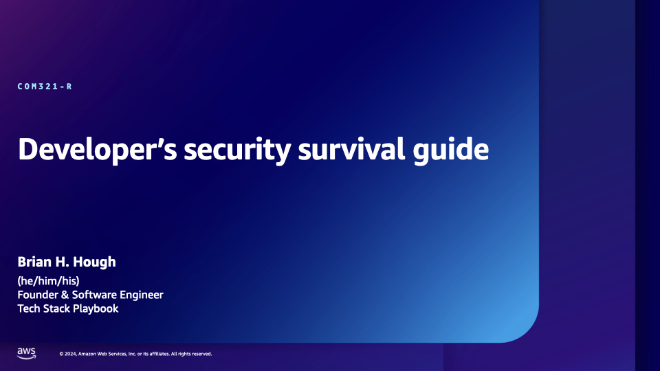
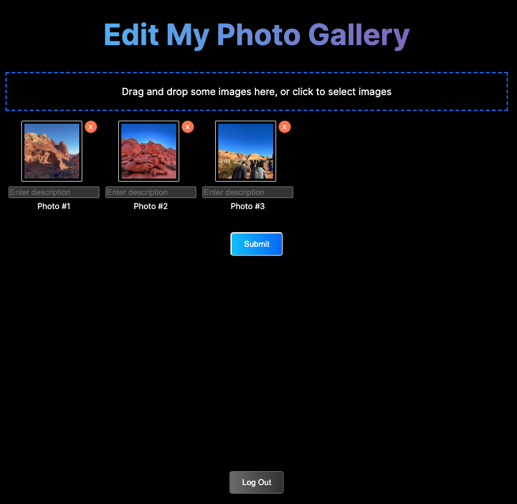

COM321-R
# Developer’s security survival guide 



## Abstract
After a long week, you’re about to sit down for dinner, and an email stops your heart cold: “Unusual behavior recognized in your account.” As a developer, you might not feel a need to become a security expert, but in today’s world, you must be one. Drawing from his client experiences at Tech Stack Playbook, Brian Hough covers essential security skills for the non-security engineer. Dive into security-first solution architecting, AI-enhanced code analysis, and effective infrastructure-as-code deployment patterns. You will walk away equipped and ready for the cloud with a security-first development mindset.

## Talk Details
- Speaker: Brian H. Hough ([Twitter](https://twitter.com/brianhhough) | [LinkedIn](https://linkedin.com/in/brianhhough))
- Session Type: Lightning Talk
- Level: 300 - Advanced
- Area of Interest: Customer stories

## Repository Details 
- Photo Gallery App (SST x Next.js): A serverlessly deployed photo gallery app with Next.js and SST deployed to AWS.
- Demo:

|  |  |
|:----------------------------:|:----------------------------:|

## Tech Stack
* 🔒 Authentication: Amazon Cognito
* 🏗️ IaC Pipeline: SST
* 💾 Database: Amazon DynamoDB
* 🪣 Bucket: Amazon S3
* 🔊 Serverless Functions: AWS Lambda (Node.js)
* 🖥️ Hosting: Amazon S3 + Amazon CloudFront
* 📱 Front-end: Next.js + TypeScript

## Step 1: Initialize SST in the root of the new Next.js project:
Note: This repository has already gone through this step. Feel free to create an empty folder and run the following to learn how SST works with setting up your full stack application for AWS.

```bash
npx create-sst@latest
```

- ? You are in a Next.js project so SST will be setup in drop-in mode. Continue? `Yes`

Install the sst npm package in your project's root:
```bash
npm i sst --save-exact
```

Install the front-end dependencies:
```bash
npm i @emotion/react @emotion/styled react-infinite-scroll-component @hello-pangea/dnd react-dropzone
```

Install the AWS dependencies:
```bash
npm i amazon-cognito-identity-js @aws-sdk/client-s3 @aws-sdk/s3-request-presigner @aws-sdk/client-dynamodb uuid aws-cdk-lib aws-cdk-lib/aws-wafv2
```

Install the AWS dev dependencies:
```bash
npm i --save-dev @types/aws-lambda @types/uuid
```

Install front-end dev-dependencies:
```bash
npm i --save  @types/react-beautiful-dnd
```


## Step 2: Start the SST dev server

**Using the `dev` stage for local development:**
- It is recommended that you use a different stage for development. 
- Read more from SST here: https://docs.sst.dev/live-lambda-development

```bash
npx sst dev --stage dev 
```

This might take awhile if happening for the first time. Keep it running if this prints out:
```bash
⠼ Deploying bootstrap stack, this only needs to happen once
```

Wait for it to ultimately print:
```bash
Start Next.js: npm run dev
```

## Step 3: Start the local dev server

In another tab in your terminal, run:
```bash
Start Next.js: npm run dev
```


## Step 4: Deploy to AWS

```bash
npx sst deploy --stage prod --profile YOUR_AWS_PROFILE
```


## Debugging:

### Did you install SST for the project repo?
If you get this error, it means that SST isn't installed with the project
```
sh: sst: command not found
```

### `npm run dev` can't execute because of the `aws-sdk`?

See a print out like the below? Be sure to delete `node_modules`, ensure the `package.json` file only inludes dependencies specifically scoped for the project, and then run `npm i`.

Or you can do this:
```bash
rm -rf node_modules
npm cache verify
npm install
```

Also make sure that the latest version of `sst` is installed:
```bash
npm install -g sst@latest
```

Error message:
```bash
> app@0.1.0 dev
> sst bind next dev

node:internal/modules/cjs/loader:1077
  const err = new Error(message);
              ^

Error: Cannot find module 'aws-sdk/lib/maintenance_mode_message'
Require stack: 
...
```

## SST Deployer Role IAM Policy Permissions List:
You will need an AWS IAM role to deploy the resources that are required for this stack, as well as one that includes the services you might need to use (later) with SST.

This is an exhaustive list:
```json
{
	"Version": "2012-10-17",
	"Statement": [
		{
			"Effect": "Allow",
			"Action": [
				"acm:DescribeCertificate",
				"acm:ListCertificates",
				"acm:RequestCertificate",
				"cloudformation:CreateChangeSet",
				"cloudformation:CreateStack",
				"cloudformation:DescribeChangeSet",
				"cloudformation:DeleteChangeSet",
				"cloudformation:DeleteStack",
				"cloudformation:DescribeStackEvents",
				"cloudformation:DescribeStackResource",
				"cloudformation:DescribeStackResources",
				"cloudformation:DescribeStacks",
				"cloudformation:ExecuteChangeSet",
				"cloudformation:GetTemplate",
				"cloudformation:ListStackResources",
				"cloudformation:UpdateStack",
				"cloudformation:ValidateTemplate",
				"cloudfront:CreateCloudFrontOriginAccessIdentity",
				"cloudfront:CreateDistribution",
				"cloudfront:CreateInvalidation",
				"cloudfront:GetDistribution",
				"cloudfront:GetDistributionConfig",
				"cloudfront:ListCloudFrontOriginAccessIdentities",
				"cloudfront:ListDistributions",
				"cloudfront:ListDistributionsByLambdaFunction",
				"cloudfront:ListDistributionsByWebACLId",
				"cloudfront:ListFieldLevelEncryptionConfigs",
				"cloudfront:ListFieldLevelEncryptionProfiles",
				"cloudfront:ListInvalidations",
				"cloudfront:ListPublicKeys",
				"cloudfront:ListStreamingDistributions",
				"cloudfront:UpdateDistribution",
				"cloudfront:TagResource",
				"cloudfront:UntagResource",
				"cloudfront:ListTagsForResource",
				"dynamodb:CreateTable",
				"dynamodb:DeleteTable",
				"dynamodb:DescribeTable",
				"dynamodb:ListTables",
				"dynamodb:UpdateTable",
				"iam:AttachRolePolicy",
				"iam:CreateRole",
				"iam:CreateServiceLinkedRole",
				"iam:DeleteRole",
				"iam:DeleteRolePolicy",
				"iam:GetRole",
				"iam:PassRole",
				"iam:PutRolePolicy",
				"iam:UpdateAssumeRolePolicy",
				"lambda:AddPermission",
				"lambda:CreateFunction",
				"lambda:DeleteFunction",
				"lambda:GetFunction",
				"lambda:GetFunctionConfiguration",
				"lambda:ListEventSourceMappings",
				"lambda:ListFunctions",
				"lambda:ListTags",
				"lambda:PublishVersion",
				"lambda:RemovePermission",
				"lambda:TagResource",
				"lambda:UntagResource",
				"lambda:UpdateFunctionCode",
				"lambda:UpdateFunctionConfiguration",
				"route53:ChangeResourceRecordSets",
				"route53:ListHostedZonesByName",
				"route53:ListResourceRecordSets",
				"s3:CreateBucket",
				"s3:DeleteBucket",
				"s3:GetAccelerateConfiguration",
				"s3:GetBucketLocation",
				"s3:GetBucketPolicy",
				"s3:GetObject",
				"s3:ListBucket",
				"s3:PutAccelerateConfiguration",
				"s3:PutBucketPolicy",
				"s3:PutBucketTagging",
				"s3:PutObject",
				"ssm:GetParameter",
				"ssm:GetParametersByPath",
				"sqs:CreateQueue",
				"sqs:DeleteQueue",
				"sqs:GetQueueAttributes",
				"sqs:SetQueueAttributes",
				"iot:DescribeEndpoint"
			],
			"Resource": "*"
		}
	]
}
```